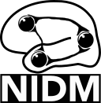

PyNIDM: Neuroimaging Data Model in Python
##########################################
A Python library to manipulate the [Neuroimaging Data Model](http://nidm.nidash.org). 

|Build Status| |Docs|

.. contents::
.. section-numbering::

Dependencies
============
* Git-annex <https://git-annex.branchable.com/install/>
* Graphviz <http://graphviz.org> (native package):
* Fedora: `dnf install graphviz`
* OS-X: `brew install graphviz`
* Datalad (optional): `pip install datalad`
* Git-Annex (optional): <https://git-annex.branchable.com/>

PyPi
======

.. code-block:: bash

	$ pip install pynidm

Creating a conda environment and installing the library (tested with OSX)
=========================================================================

macOS
-----  
.. code-block:: bash

	$ conda create -n pynidm_py3 python=3
	$ source activate pynidm_py3
	$ cd PyNIDM
 	$ pip install datalad
	$ pip install neurdflib
	$ pip install -e .

You can try to run a test: `pytest`

NIDM-Experiment Tools
=====================

BIDS MRI Conversion to NIDM
---------------------------

This program will convert a BIDS MRI dataset to a NIDM-Experiment RDF document.  It will parse phenotype information and simply store variables/values and link to the associated json data dictionary file.  To use this tool please set your INTERLEX_API_KEY environment variable to your unique API key.  To get an Interlex API key you visit [SciCrunch](http://scicrunch.org/nidm-terms), register for an account, then click on "MyAccount" and "API Keys" to add a new API key for your account.

.. code-block:: bash

   $ bidsmri2nidm -d [ROOT BIDS DIRECT] -bidsignore

   usage: bidsmri2nidm [-h] -d DIRECTORY [-jsonld] [-bidsignore] [-no_concepts]
                    [-json_map JSON_MAP] [-log LOGFILE] [-o OUTPUTFILE]

   This program will represent a BIDS MRI dataset as a NIDM RDF document and provide user with opportunity to annotate
   the dataset (i.e. create sidecar files) and associate selected variables with broader concepts to make datasets more
   FAIR. 

   Note, you must obtain an API key to Interlex by signing up for an account at scicrunch.org then going to My Account
   and API Keys.  Then set the environment variable INTERLEX_API_KEY with your key. 

   optional arguments:
     -h, --help            show this help message and exit
     -d DIRECTORY          Full path to BIDS dataset directory
     -jsonld, --jsonld     If flag set, output is json-ld not TURTLE
     -bidsignore, --bidsignore
                        If flag set, tool will add NIDM-related files to .bidsignore file
     -no_concepts, --no_concepts
                        If flag set, tool will no do concept mapping
     -log LOGFILE, --log LOGFILE
                        Full path to directory to save log file. Log file name is bidsmri2nidm_[basename(args.directory)].log
     -o OUTPUTFILE         Outputs turtle file called nidm.ttl in BIDS directory by default..or whatever path/filename is set here

   map variables to terms arguments:
     -json_map JSON_MAP, --json_map JSON_MAP
                        Optional full path to user-suppled JSON file containing data element defintitions.

CSV File to NIDM Conversion
---------------------------
This program will load in a CSV file and iterate over the header variable
names performing an elastic search of https://scicrunch.org/nidm-terms for NIDM-ReproNim
tagged terms that fuzzy match the variable names. The user will then
interactively pick a term to associate with the variable name. The resulting
annotated CSV data will then be written to a NIDM data file.  To use this tool please set your INTERLEX_API_KEY environment variable to your unique API key.  To get an Interlex API key you visit [SciCrunch](http://scicrunch.org/nidm-terms), register for an account, then click on "MyAccount" and "API Keys" to add a new API key for your account.

.. code-block:: bash

  usage: csv2nidm [-h] -csv CSV_FILE [-json_map JSON_MAP | -redcap REDCAP]
                  [-nidm NIDM_FILE] [-no_concepts] [-log LOGFILE] -out
                  OUTPUT_FILE

  This program will load in a CSV file and iterate over the header variable
  names performing an elastic search of https://scicrunch.org/ for NIDM-ReproNim
  tagged terms that fuzzy match the variable names. The user will then
  interactively pick a term to associate with the variable name. The resulting
  annotated CSV data will then be written to a NIDM data file. Note, you must
  obtain an API key to Interlex by signing up for an account at scicrunch.org
  then going to My Account and API Keys. Then set the environment variable
  INTERLEX_API_KEY with your key.  The tool supports import of RedCap data
  dictionaries and will convert relevant information into a json-formatted
  annotation file used to annotate the data elements in the resulting NIDM file.

  optional arguments:
    -h, --help            show this help message and exit
    -csv CSV_FILE         Full path to CSV file to convert
    -json_map JSON_MAP    Full path to user-suppled JSON file containing
                          variable-term mappings.
    -redcap REDCAP        Full path to a user-supplied RedCap formatted data
                          dictionary for csv file.
    -nidm NIDM_FILE       Optional full path of NIDM file to add CSV->NIDM
                          converted graph to
    -no_concepts          If this flag is set then no concept associations will
                          beasked of the user. This is useful if you already
                          have a -json_map specified without concepts and want
                          tosimply run this program to get a NIDM file with user
                          interaction to associate concepts.
    -log LOGFILE, --log LOGFILE
                          full path to directory to save log file. Log file name
                          is csv2nidm_[arg.csv_file].log
    -out OUTPUT_FILE      Full path with filename to save NIDM file

convert
-------
This function will convert NIDM files to various RDF-supported formats and
name then / put them in the same place as the input file.

.. code-block:: bash

  Usage: pynidm convert [OPTIONS]

  Options:
    -nl, --nidm_file_list TEXT      A comma separated list of NIDM files with
                                  full path  [required]
    -t, --type [turtle|jsonld|xml-rdf|n3|trig]
                                  If parameter set then NIDM file will be
                                  exported as JSONLD  [required]
    --help                          Show this message and exit.

.. |Build Status| image:: https://travis-ci.org/incf-nidash/PyNIDM.svg?branch=master
    :target: https://travis-ci.org/incf-nidash/PyNIDM
    :alt: Build status of the master branch
.. |Docs| image:: https://readthedocs.org/projects/pynidm/badge/?version=latest&style=plastic
    :target: https://pynidm.readthedocs.io/en/latest/
    :alt: ReadTheDocs Documentation of master branch

concatenate
-----------
This function will concatenate NIDM files.  Warning, no merging will be
done so you may end up with multiple prov:agents with the same subject id
if you're concatenating NIDM files from multiple vists of the same study.
If you want to merge NIDM files on subject ID see pynidm merge

.. code-block:: bash

  Usage: pynidm concat [OPTIONS]

  Options:
    -nl, --nidm_file_list TEXT  A comma separated list of NIDM files with full
                              path  [required]
    -o, --out_file TEXT         File to write concatenated NIDM files
                              [required]
    --help                      Show this message and exit.
  
visualize
---------
This command will produce a visualization(pdf) of the supplied NIDM files
named the same as the input files and stored in the same directories.

.. code-block:: bash

  Usage: pynidm visualize [OPTIONS]

  Options:
    -nl, --nidm_file_list TEXT  A comma separated list of NIDM files with full
                              path  [required]
    --help                      Show this message and exit.
  
merge
-----
This function will merge NIDM files.  See command line parameters for
supported merge operations.

.. code-block:: bash

   Usage: pynidm merge [OPTIONS]

   Options:
     -nl, --nidm_file_list TEXT  A comma separated list of NIDM files with full
                              path  [required]
     -s, --s                     If parameter set then files will be merged by
                              ndar:src_subjec_id of prov:agents
	 -o, --out_file TEXT         File to write concatenated NIDM files
                              [required]
	 --help                      Show this message and exit.

Query
-----
This function provides query support for NIDM graphs.

.. code-block:: bash

Usage: pynidm query [OPTIONS]

Options:
  -nl, --nidm_file_list TEXT      A comma separated list of NIDM files with
                                  full path  [required]
  -nc, --cde_file_list TEXT       A comma separated list of NIDM CDE files
                                  with full path. Can also be set in the
                                  CDE_DIR environment variable
  -q, --query_file FILENAME       Text file containing a SPARQL query to
                                  execute
  -p, --get_participants          Parameter, if set, query will return
                                  participant IDs and prov:agent entity IDs
  -i, --get_instruments           Parameter, if set, query will return list of
                                  onli:assessment-instrument:
  -iv, --get_instrument_vars      Parameter, if set, query will return list of
                                  onli:assessment-instrument: variables
  -de, --get_dataelements         Parameter, if set, will return all
                                  DataElements in NIDM file
  -debv, --get_dataelements_brainvols
                                  Parameter, if set, will return all brain
                                  volume DataElements in NIDM file along with
                                  details
  -bv, --get_brainvols            Parameter, if set, will return all brain
                                  volume data elements and values along with
                                  participant IDs in NIDM file
  -o, --output_file TEXT          Optional output file (CSV) to store results
                                  of query
  -u, --uri TEXT                  A REST API URI query
  -j / -no_j                      Return result of a uri query as JSON
  -v, --verbosity TEXT            Verbosity level 0-5, 0 is default
  --help                          Show this message and exit.

Details on the REST API URI format and usage can be found on the :ref:`REST API usage<rest>` page.

.. _rest:

PyNIDM: REST API and Command Line Usage
##########################################

Introduction
============

There are two main ways to interact with NIDM data using the PyNIDM REST API. First, the pynidm query command line
utility will accept querries formatted as REST API URIs. Second, the rest-server.py script can be used to run a
HTTP server to accept and process requests. This script can either be run directly or using a docker container
defined in the docker directory of the project.

Example usage:

.. code-block:: bash

   $ pynidm query -nl "cmu_a.ttl,cmu_b.ttl" -u /projects

   dc1bf9be-10a3-11ea-8779-003ee1ce9545
   ebe112da-10a3-11ea-af83-003ee1ce9545

   $

Installation
============

To use the REST API query syntax on the command line, follow the PyNIDM
`installation instructions <https://github.com/incf-nidash/PyNIDM/>`_.

The simplest way to deploy a HTTP REST API server would be with the provided docker container. You can find instructions
for that process in the `README.md <https://github.com/incf-nidash/PyNIDM/tree/master/docker>`_ file in the docker
directory of the Github repository.

URI formats
===========

You can find details on the REST API at the `SwaggerHub API Documentation <https://app.swaggerhub.com/apis-docs/albertcrowley/PyNIDM>`_.
The OpenAPI specification file is part of the Github repository in 'docs/REST_API_definition.openapi.yaml'

Here is a list of the current operations. See the SwaggerHub page for more details and return formats.

::

- /projects
- /projects/{project_id}
- /projects/{project_id}/subjects
- /projects/{project_id}/subjects?filter=[filter expression]
- /projects/{project_id}/subjects/{subject_id}
- /projects/{project_id}/subjects/{subject_id}/instruments/{instrument_id}
- /projects/{project_id}/subjects/{subject_id}/derivatives/{derivative_id}
- /statistics/projects/{project_id}

You can append the following query parameters to many of the operations:

::

- filter
- field

Operations
-----------

**/projects**
 | Get a list of all project IDs available.
 | Supported query parameters: none

**/projects/{project_id}**
 | See some details for a project. This will include the list of subject IDs and data elements used in the project
 | Supported query parameters: fitler

**/projects/{project_id}/subjects**
 | Get the list of subjects in a project
 | Supported query parameters: filter

**/projects/{project_id}/subjects/{subject_id}**
 | Get the details for a particular subject. This will include the results of any instrumnts or derivatives associated with the subject, as well a a list of the related activites.
 | Supported query parameters: none

**/projects/{project_id}/subjects/{subject_id}/instruments/{instrument_id}**
 | Get the values for a particular instrument
 | Supported query parameters: none

**/projects/{project_id}/subjects/{subject_id}/derivatives/{derivative_id}**
 | Get the values for a particular derivative
 | Supported query parameters: none

**/statistics/projects/{project_id}**
 | See project statistics. You can also use this operation to get statsitcs on a particular instrument or derivative entry by use a *field* query option.
 | Supported query parameters: filter, field

**/statistics/projects/{project_id}/subjects/{subject_id}**
 | See some details for a project. This will include the list of subject IDs and data elements used in the project
 | Supported query parameters: none

Query Parameters
-----------------

**filter**
 | The filter query parameter is ues when you want to receive data only on subjects that match some criteria.  The format for the fitler value should be of the form:
 |    *identifier op value [ and identifier op value and ... ]*
 | Identifers should be formatted as "instrument.ID" or "derivatives.ID"  You can use any value for the instrument ID that is shown for an instrument or in the data_elements section of the project details. For the derivative ID, you can use the last component of a derivative field URI (ex. for the URI http://purl.org/nidash/fsl#fsl_000007, the ID would be "fsl_000007") or the exact label shown when viewing derivative data (ex. "Left-Caudate (mm^3)")
 | The *op* can be one of "eq", "gt", "lt"

 | **Example filters:**
 |    *?filter=instruments.AGE_AT_SCAN gt 30*
 |    *?filter=instrument.AGE_AT_SCAN eq 21 and derivative.fsl_000007 lt 3500*

**fields**
 | The fields query parameter is used to specify what fields should be detailed in a statistics operation. For each field specified the result will show minimum, maximum, average, median, and standard deviation for the values of that field across all subjects matching the operation and filter. Multiple fields can be specified by separating each field with a comma.
 | Fields should be formatted in the same way as identifiers are specified in the filter parameter.

 | **Example field query:**
 |    *http://localhost:5000/statistics/projects/abc123?field=instruments.AGE_AT_SCAN,derivatives.fsl_000020*

Return Formatting
==================

By default the HTTP REST API server will return JSON formatted objects or arrays.  When using the pynidm query
command line utility the default return format is text (when possible) or you can use the -j option to have the
output formatted as JSON.

Examples
--------

**Get the UUID for all the projects at this locaiton:**

.. code-block:: bash

   curl http://localhost:5000/projects

Example response:

.. code-block:: JSON

   [
       "dc1bf9be-10a3-11ea-8779-003ee1ce9545"
   ]

**Get the project summary details:**

.. code-block:: HTML

   curl http://localhost:5000/projects/dc1bf9be-10a3-11ea-8779-003ee1ce9545

Example response:

.. code-block:: JSON

   {
    "http://www.w3.org/1999/02/22-rdf-syntax-ns#type": "http://purl.org/nidash/nidm#Project",
    "dctypes:title": "ABIDE CMU_a Site",
    "http://www.w3.org/ns/prov#Location": "/datasets.datalad.org/abide/RawDataBIDS/CMU_a",
    "sio:Identifier": "1.0.1",
    "nidm:NIDM_0000171": 14,
    "age_max": 33.0,
    "age_min": 21.0,
    "ndar:gender": [
        "1",
        "2"
    ],
    "obo:handedness": [
        "R",
        "L",
        "Ambi"
    ]
   }

**Get the subjects in a project:**

.. code-block:: HTML

   pynidm query -nl "cmu_a.nidm.ttl" -u http://localhost:5000/projects/dc1bf9be-10a3-11ea-8779-003ee1ce9545/subjects

Example response:

.. code-block:: JSON

   deef8eb2-10a3-11ea-8779-003ee1ce9545
   df533e6c-10a3-11ea-8779-003ee1ce9545
   ddbfb454-10a3-11ea-8779-003ee1ce9545
   df21cada-10a3-11ea-8779-003ee1ce9545
   dcfa35b2-10a3-11ea-8779-003ee1ce9545
   de89ce4c-10a3-11ea-8779-003ee1ce9545
   dd2ce75a-10a3-11ea-8779-003ee1ce9545
   ddf21020-10a3-11ea-8779-003ee1ce9545
   debc0f74-10a3-11ea-8779-003ee1ce9545
   de245134-10a3-11ea-8779-003ee1ce9545
   dd5f2f30-10a3-11ea-8779-003ee1ce9545
   dd8d4faa-10a3-11ea-8779-003ee1ce9545
   df87cbaa-10a3-11ea-8779-003ee1ce9545
   de55285e-10a3-11ea-8779-003ee1ce9545

**Use the command line to get statistics on a project for the AGE_AT_SCAN and a FSL data element:**

.. code-block:: HTML

   pynidm query -nl ttl/cmu_a.nidm.ttl -u /statistics/projects/dc1bf9be-10a3-11ea-8779-003ee1ce9545?fields=instruments.AGE_AT_SCAN,derivatives.fsl_000001

Example response:

.. code-block:: bash

  -------------------------------------------------  ---------------------------------------------
  "http://www.w3.org/1999/02/22-rdf-syntax-ns#type"  http://www.w3.org/ns/prov#Activity
  "title"                                            ABIDE CMU_a Site
  "Identifier"                                       1.0.1
  "prov:Location"                                    /datasets.datalad.org/abide/RawDataBIDS/CMU_a
  "NIDM_0000171"                                     14
  "age_max"                                          33.0
  "age_min"                                          21.0

    gender
  --------
         1
         2

  handedness
  ------------
  R
  L
  Ambi

  subjects
  ------------------------------------
  de89ce4c-10a3-11ea-8779-003ee1ce9545
  deef8eb2-10a3-11ea-8779-003ee1ce9545
  dd8d4faa-10a3-11ea-8779-003ee1ce9545
  ddbfb454-10a3-11ea-8779-003ee1ce9545
  de245134-10a3-11ea-8779-003ee1ce9545
  debc0f74-10a3-11ea-8779-003ee1ce9545
  dd5f2f30-10a3-11ea-8779-003ee1ce9545
  ddf21020-10a3-11ea-8779-003ee1ce9545
  dcfa35b2-10a3-11ea-8779-003ee1ce9545
  df21cada-10a3-11ea-8779-003ee1ce9545
  df533e6c-10a3-11ea-8779-003ee1ce9545
  de55285e-10a3-11ea-8779-003ee1ce9545
  df87cbaa-10a3-11ea-8779-003ee1ce9545
  dd2ce75a-10a3-11ea-8779-003ee1ce9545

  -----------  ------------------  --------
  AGE_AT_SCAN  max                 33
  AGE_AT_SCAN  min                 21
  AGE_AT_SCAN  median              26
  AGE_AT_SCAN  mean                26.2857
  AGE_AT_SCAN  standard_deviation   4.14778
  -----------  ------------------  --------

  ----------  ------------------  -----------
  fsl_000001  max                 1.14899e+07
  fsl_000001  min                 5.5193e+06
  fsl_000001  median              7.66115e+06
  fsl_000001  mean                8.97177e+06
  fsl_000001  standard_deviation  2.22465e+06
  ----------  ------------------  -----------

**Get details on a subject. Use -j for a JSON formatted resonse:**

.. code-block:: HTML

   pynidm query -j -nl "cmu_a.nidm.ttl" -u http://localhost:5000/projects/dc1bf9be-10a3-11ea-8779-003ee1ce9545/subjects/df21cada-10a3-11ea-8779-003ee1ce9545

Example response:

.. code-block:: JSON

   {
  "uuid": "df21cada-10a3-11ea-8779-003ee1ce9545",
  "id": "0050665",
  "activity": [
    "e28dc764-10a3-11ea-a7d3-003ee1ce9545",
    "df28e95a-10a3-11ea-8779-003ee1ce9545",
    "df21c76a-10a3-11ea-8779-003ee1ce9545"
  ],
  "instruments": {
    "e28dd218-10a3-11ea-a7d3-003ee1ce9545": {
      "SRS_VERSION": "nan",
      "ADOS_MODULE": "nan",
      "WISC_IV_VCI": "nan",
      "WISC_IV_PSI": "nan",
      "ADOS_GOTHAM_SOCAFFECT": "nan",
      "VINELAND_PLAY_V_SCALED": "nan",
      "null": "http://www.w3.org/ns/prov#Entity",
      "VINELAND_EXPRESSIVE_V_SCALED": "nan",
      "SCQ_TOTAL": "nan",
      "SRS_MOTIVATION": "nan",
      "PIQ": "104.0",
      "FIQ": "109.0",
      "WISC_IV_PRI": "nan",
      "FILE_ID": "CMU_a_0050665",
      "VIQ": "111.0",
      "WISC_IV_VOCAB_SCALED": "nan",
      "VINELAND_DAILYLVNG_STANDARD": "nan",
      "WISC_IV_SIM_SCALED": "nan",
      "WISC_IV_DIGIT_SPAN_SCALED": "nan",
      "AGE_AT_SCAN": "33.0"
      }
   },
  "derivatives": {
      "b9fe0398-16cc-11ea-8729-003ee1ce9545": {
         "URI": "http://iri.nidash.org/b9fe0398-16cc-11ea-8729-003ee1ce9545",
         "values": {
           "http://purl.org/nidash/fsl#fsl_000005": {
             "datumType": "ilx_0102597",
             "label": "Left-Amygdala (voxels)",
             "value": "1573",
             "units": "voxel"
           },
           "http://purl.org/nidash/fsl#fsl_000004": {
             "datumType": "ilx_0738276",
             "label": "Left-Accumbens-area (mm^3)",
             "value": "466.0",
             "units": "mm^3"
           },
           "http://purl.org/nidash/fsl#fsl_000003": {
             "datumType": "ilx_0102597",
             "label": "Left-Accumbens-area (voxels)",
             "value": "466",
             "units": "voxel"
           }
         },
         "StatCollectionType": "FSLStatsCollection"
      }
   }

Additional NIDM-related Tools
=============================

* NIDM-Terms <https://github.com/NIDM-Terms/terms>
* NIDM-Terms Scicrunch Interface <https://scicrunch.org/nidm-terms>
* Freesurfer stats -> NIDM <https://github.com/repronim/segstats_jsonld>
* FSL structural segmentation -> NIDM <https://github.com/ReproNim/fsl_seg_to_nidm>
* ANTS structural segmentation -> NIDM <https://github.com/ReproNim/ants_seg_to_nidm>

