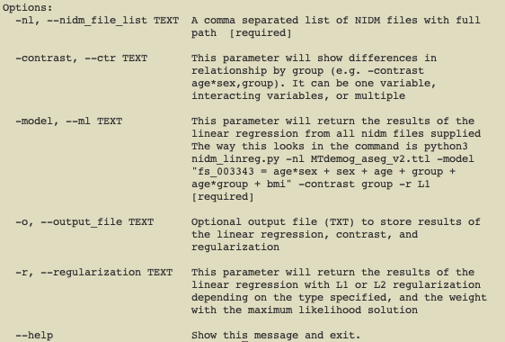
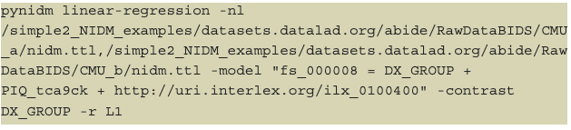

---
title: 'The Neuroimaging Data Model (NIDM) Linear Regression Tool'
tags:
  - Python
  - neuroscience
  - RDF
authors:
  - name: Ashmita Kumar
    affiliation: 1
  - name: Albert Crowley
    affiliation: 2
  - name: Nazek Quedar
    affiliation: 3
  - name: JB Poline
    affiliation: 4
  - name: Satrajit S. Ghosh
    affiliation: 5
  - name: David Kennedy
    affiliation: 6
  - name: Jeff Grethe
    affiliation: 7
  - name: Karl G. Helmer
    affiliation: 8
  - name: David B. Keator
    affiliation: 3
affiliations:
 - name: Troy High School. Fullerton, CA., USA.
   index: 1
 - name: TCG, Inc., Washington, DC, USA.
   index: 2
 - name: University of California, Irvine. Psychiatry and Human Behavior, Irvine, CA., USA.
   index: 3
 - name: McGill University, Montreal, Faculty of Medicine and Health Sciences, Department of Neurology and Neurosurgery, McConnell Brain Imaging Centre, Canada.
   index: 4
 - name: McGovern Institute for Brain Research, Massachusetts Institute of Technology (MIT), Cambridge, MA, USA; Department of Otolaryngology, Harvard Medical School, Boston, MA, USA.
   index: 5
 - name: Eunice Kennedy Shriver Center, Department of Psychiatry, University of Massachusetts Medical School, Worcester, Massachusetts, 01655, USA.
   index: 6
 - name: Center for Research in Biological Systems, University of California, San Diego, USA.
   index: 7
 - name: Massachusetts General Hospital, Department of Radiology; Harvard Medical School, Department of Radiology, Boston, MA, USA.
   index: 8
date: 2 August 2021
bibliography: paper.bib
---

# Introduction

The Neuroimaging Data Model (NIDM)[@Keator2013-fs; @NIDM_Working_Group_undated-eb; @Maumet2016-ab] was started by an international team of cognitive scientists, computer scientists and statisticians to develop a data format capable of describing all aspects of the data lifecycle, from raw data through analyses and provenance. NIDM was built on top of the PROV standard[@Moreau2008-bu; @noauthor_undated-he] and consists of three main interconnected specifications: Experiment, Results, and Workflow. These specifications were envisioned to capture information on all aspects of the neuroimaging data lifecycle, using semantic web techniques[@noauthor_undated-cd] which are essentially annotated graphs. These graphs can be serialized into a variety of text-based document formats (NIDM documents), and using the capabilities of the semantic web, can be used to link datasets together based on both the consistency of annotations across NIDM documents and using ontologies that relate terms used in the annotations. They provide a critical capability to aid in reproducibility and replication of studies, as well as data discovery in shared resources. The NIDM-Experiment module consists of a simple project - session - acquisition hierarchy which can be used to describe both the content and metadata about experimental studies. It has has been used to describe many large publicly-available human neuroimaging datasets (e.g. ABIDE[@Di_Martino2014-af], ADHD200[@noauthor_undated-os], CoRR[@Zuo2014-tw], OpenNeuro[@noauthor_undated-ex] datasets) along with providing unambiguous descriptions of the clinical, neuropsychological, and imaging data collected as part of those studies. This has resulted in approximately 4.5 million statements about aspects of these datasets.

PyNIDM[@noauthor_undated-on], a toolbox written in Python, supports the creation, manipulation, and query of NIDM documents. It is an open-source project hosted on GitHub and distributed under the Apache License, Version 2.0[@noauthor_undated-eh]. PyNIDM is under active development and testing. Tools have been created to support RESTful[@Ravan2020-il] SPARQL[@noauthor_undated-gx] queries of the NIDM documents (i.e. pynidm query) in support of users wanting to identify interesting cohorts across datasets in support of evaluating scientific hypotheses and/or replicating results found in the literature. This query functionality, together with the NIDM document semantics, provides a path for investigators to interrogate datasets, understand what data was collected in those studies, and provide sufficiently-annotated data dictionaries of the variables collected to facilitate transformation and combining of data across studies. Additional tools have been developed to import information into NIDM graphs, to visualize the graphs, to merge graphs based on study participant IDs, and to convert semantic-web serializations to more common data structures such as JSON-LD (linked-data variant of JSON).

Beyond the existing tools that have been written to support NIDM graph documents,  some high-level statistical analysis tools are needed to provide investigators with an opportunity to gain more insight into data they may be interested in combining for a complete scientific investigation. Combining datasets collected across different studies is not a trivial task. It requires both a complete, unambiguous description of the data and how it was collected (NIDM-Experiment graphs), along with a varying number of transformations to align, where possible, disparate data. The process of transforming data is often quite time consuming and therefore understanding whether the identified datasets, at a high level, might have some interesting relationships prior to committing to a full scientific study is prudent. Here we report on a tool that provides such capabilities; namely, to provide a simple linear modeling tool supporting the comparison of user-selected variables and information stored in NIDM documents and accessible in a consistent form with other PyNIDM tools (i.e. pynidm linear-regression).

# Statement of Need

While tools and libraries for statistics and machine learning algorithms are numerous, there are none that can be directly applied to NIDM documents. The linear regression algorithm presented here allows scientists studying the human brain to find relationships between variables across datasets while retaining the provenance present in NIDM documents. The algorithm has the ability to query for specific variables or across similar variables from different studies using concept annotations on variables. It then provides the user with the ability to construct arbitrary linear models on those data, supporting interactions between variables, contrasts of learned parameter sets, and L1 and L2 regularization[@Nagpal2017-qd]. There is no comparable tool for this use case.

# Software Usage and Outputs

The algorithm aggregates and parses data serialized using the standard Terse Resource Description Framework (RDF) Triple Language (TURTLE) [@noauthor_undated-sw], a common semantic-web serialization format that is both structured for ease of use with computers and relatively easy for humans to read. Researchers have the ability to construct custom models based on their scientific goals. In addition, since the code is in Python, it is flexible and easy to maintain and extend.

There are error checks within the code to make sure the researcher has feedback on why a model cannot run, whether it is because there are not enough data points or because one or more variables could not be found in one or more of the NIDM documents. This makes the experience as simple as possible for the user, which is important as our intended audience for these tools are investigators who may have no prior experience with the semantic web and/or NIDM documents.

Thus, the algorithm provides the benefit of a machine learning algorithm that can work on complex datasets described using semantic web and linked-data technologies, while being reasonably easy to use. Researchers have the ability to conduct a preliminary analysis to understand if it is worth the effort to pursue combining datasets and doing the transformations necessary to make those datasets scientifically valid to combine. One can quickly determine if there are high-level relationships in the datasets, and look at the different weights to decide what variables may warrant further study.

The tool provides a simple command-line user interface (\autoref{fig:Fig-1}) based on the Click Python library[@noauthor_undated-az] which integrates the linear regression module with existing pynidm tools (e.g. pynidm query, pynidm convert, pynidm visualize).

To use the tool, the user runs the command pynidm linear-regression with a variety of required and optional parameters. The first parameter “-nl” is a comma- separated list of NIDM serialized TURTLE files, each representing a single dataset or a collection site within a multi-site research project (\autoref{fig:Fig-2}). A useful set of NIDM documents describing publicly-available neuroimaging data from the ABIDE[@Di_Martino2014-af], ADHD200[@noauthor_undated-os], and CoRR[@Zuo2014-tw] studies along with datasets in the OpenNeuro database can be found on GitHub[@Keator_undated-eb]. NIDM documents contain both data and metadata of participants involved in neuroimaging studies, ranging from assessments to raw and derived (regional brain volume, mass-univariate functional brain analysis) neuroimaging data.

The next parameter, “-model” provides the user with the ability to construct a linear model using standard notation found in popular statistics packages (e.g. R statistical software[@Ripley2001-iu]). The syntax follows the scheme “dependent variable (DV) = independent variable 1 (IV1) + independent variable 2 (IV2)”. To encode interactions between IV1 and IV2 in the above example, one can use the common “*” syntax: “DV = IV1 + IV2 + IV1*IV2”. To determine what variables or data elements are available from a set of NIDM documents, the first step is to use “pynidm query” to do a data element search of the NIDM documents. From this search, the user can see what data elements are available in the selected NIDM documents and understand some details of those data elements (e.g. ranges, categories, data type, etc.). After performing the data elements query of the NIDM documents and selecting independent and dependent variables of interest, one proceeds with constructing the linear model with the pynidm linear-regression tool.

In the example shown in \autoref{fig:Fig-2}, we have first run a pynidm query operation on the NIDM documents and identified four variables of interest: supratentorial brain volume (fs_000008), diagnostic group (DX_GROUP), performance IQ (PIQ_tca9ck), and age. The model specified establishes the relationship between the DV, brain volume, and the IVs, diagnostic group, performance IQ, and age. In this example, fs_000008 is the fixed unique identifier (UUID) of the supratentorial brain volume computed with the FreeSurfer software[@Fischl2012-cq] using the original Magnetic Resonance Imaging (MRI) structural scans of the brain. This particular UUID is fixed because it identifies a specific brain region and measurement computed with the FreeSurfer software and will not change across datasets that derive brain volume measurements with FreeSurfer. DX_GROUP is the name of the study-specific variable describing the diagnostic group assigned to participants. PIQ_tca9ck is the performance IQ measure collected on study participants and is the UUID created for this data element when the NIDM documents were created for this dataset. Note, this particular UUID is not guaranteed to be the same across NIDM documents from different studies. Finally, https://urldefense.com/v3/__http://uri.interlex.org/ilx_0100400__;!!OLgoXmg!DBnZP1sUXq9i6aeL_u17nlbXYqcFpnmGxSssHbXH-p6gBHMjrSfQVqMUwAPF27WQtQ$  is the age of the participants using a URL form to reference a concept describing the high-level measure of age which has been used to annotate the variables measuring age across studies. Here we use a concept URL which has been mapped to each dataset’s separate variables that store the age of participants. By using the concept URL we avoid the complexity of different variable names being used to store consistent information (e.g. age) across datasets.

This example shows that one can select data elements from the NIDM documents for linear regression using three specific forms: (1) using the UUID of the objects in the NIDM graph documents; (2) using the distinct variable name from the original dataset, also stored as metadata in the NIDM graph documents; (3) using a high-level concept that has been associated with specific variables described by the concept across datasets, used to make querying across datasets with different variable names but measuring the same phenomenon easier. We support these three distinct forms of selecting data elements to enable distinct usage patterns. Some investigators will use NIDM documents of their internal studies and want to be able to reference data elements using their study-specific variable names. Other investigators may want to use variables from different studies and thus the variable names are unlikely to be the same; thus, we support the use of selecting variables based on high-level concepts. In practice, users will not often mix forms of referring to data elements within the same model but we show it here to make evident the flexibility of the tool.

The “-contrast” parameter allows one to select one or more IVs to contrast the parameter estimates for those IVs. The contrast variable in this example is “DX_GROUP” which describes the diagnostic group of each participant in the ABIDE study. Our tool supports multiple methods of coding treatment variables (e.g. treatment coding (\autoref{fig:Fig-3}), simple coding, sum coding, backward difference coding, and Helmert coding) as made available by the Patsy Python library[@Brooke1923-dx]. The user can select multiple independent variables to contrast and/or contrasts on interactions.

The “-r” parameter allows the user to select L1 (Lasso) or L2 (Ridge) regularization implemented in scikit-learn[@Varoquaux2015-mv]. In either case, regularizing prevents the data from being overfit, potentially improving model generalizability and demonstrating which variables have the strongest relationships with the dependent variable. The regularization weight is iteratively determined across a wide range of regularization weightings using 10-fold cross-validation, selecting the regularization weight yielding the maximum likelihood.

# Conclusions

In this work we have designed a linear regression tool that works on linked-data NIDM documents in support of understanding relationships between variables collected across different research studies. This tool helps scientists evaluate relationships between data at a high level prior to fully integrating datasets for hypothesis testing which may require considerable time and resources. In our initial evaluations, this tool has shown utility for these use-cases. In future work we are creating additional machine learning tools allowing users to cluster data in a similar fashion to the linear regression tool presented here. Further, we intend to add additional functionality that uses the data dictionaries for all study variables contained within NIDM documents selected for modeling and applies mapping functions to remap variable values into common ranges and domains, when necessary, prior to running the linear regression models.

# Acknowledgements

This work has been supported by the National Institute of Mental Health under grant RF1 MH120021 (PI:Keator), the International Neuroinformatics Coordinating Facility (INCF), and from the National Institute of Biomedical Imaging and Bioengineering P41 EB019936 (PI:Kennedy).

# References
