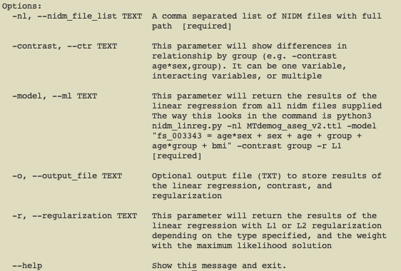
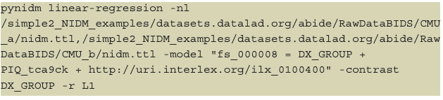
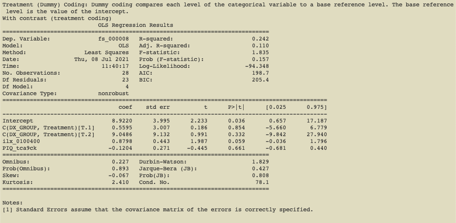

---
title: 'nidm_linreg: PyNIDM project'
tags:
  - Python
  - neuroscience
  - RDF
authors:
  - name: Ashmita Kumar
    affiliation: 1
  - name: Albert Crowley 
    affiliation: 2
  - name: Author David B. Keator
    affiliation: 3
affiliations:
 - name: Troy High School. Fullerton, CA., USA.
   index: 1
 - name: 
   index: 2
 - name: University of California, Irvine. Psychiatry and Human Behavior, Irvine, CA., USA. 
   index: 3
date: 25 July 2021
bibliography: paper.bib
---

# Introduction

The Neuroimaging Data Model (NIDM)(D. B. Keator et al. 2013; NIDM Working Group n.d.; Maumet et al. 2016) was started by an international team of cognitive scientists, computer scientists and statisticians to develop a data format capable of describing all aspects of the data lifecycle, from raw data through analyses and provenance. NIDM was built on top of the PROV standard(Moreau et al. 2008; “PROV-Overview” n.d.) and consists of three main interconnected specifications: Experiment, Results, and Workflow. These specifications were envisioned to capture information on all aspects of the neuroimaging data lifecycle, using semantic web techniques(“Semantic Web - W3C” n.d.). They provide a critical capability to aid in reproducibility and replication of studies, as well as data discovery in shared resources. The NIDM-Experiment component has been used to describe publicly-available human neuroimaging datasets (e.g. ABIDE(Di Martino et al. 2014), ADHD200(“ADHD200” n.d.), CoRR(Zuo et al. 2014), OpenNeuro(“OpenNeuro” n.d.) datasets) along with providing unambiguous descriptions of the clinical, neuropsychological, and imaging data collected as part of those studies resulting in approximately 4.5 million statements about aspects of these datasets. 

PyNIDM(PyNIDM n.d.), a toolbox written in Python, supports the creation, manipulation, and query of NIDM documents. It is an open-source project hosted on GitHub and distributed under the Apache License, Version 2.0(“Apache License, Version 2.0” n.d.). PyNIDM is under active development and testing. Tools have been created to support RESTful(Ravan et al. 2020) SPARQL(“SPARQL Query Language for RDF” n.d.) queries of the NIDM documents (i.e. pynidm query) in support of users wanting to identify interesting cohorts across datasets in support of evaluating scientific hypotheses and/or replicating results found in the literature. This query functionality, together with the NIDM document semantics, provides a path for investigators to interrogate datasets, understand what data was collected in those studies, and provide sufficiently-annotated data dictionaries of the variables collected to facilitate transformation and combining of data across studies. 

Beyond querying across NIDM documents, some high-level statistical analysis tools are needed to provide investigators with an opportunity to gain more insight into data they may be interested in combining for a complete scientific investigation. Here we report on one such tool providing linear modeling support for NIDM documents (i.e. pynidm linear-regression). 

# Statement of Need

While tools and libraries for statistics and machine learning algorithms are numerous, there are none that can be directly applied to NIDM documents. The linear regression algorithm presented here allows scientists studying the human brain to find relationships between variables across datasets. The algorithm has the ability to query for specific variables or across similar variables from different studies using concept annotations on variables. It then provides the user with the ability to construct arbitrary linear models on those data, supporting interactions between variables, contrasts of learned parameter sets, and L1 and L2 regularization(Nagpal 2017). 

# Software Usage and Outputs

The algorithm aggregates and parses data serialized using the standard Terse Resource Description Framework (RDF) Triple Language (TURTLE) (“RDF 1.1 Turtle” n.d.). Researchers have the ability to construct custom models based on their scientific goals. In addition, since the code is in Python, it is flexible and easy to maintain and extend.

Finally, there are existing error checks within the code to make sure the researcher has feedback on why a model cannot run, whether it is because there are not enough data points or because one or more variables could not be found in one or more of the NIDM documents. This makes the experience as simple as possible for the user which is important as our intended audience for these tools are investigators who may have no prior experience with the semantic web and/or NIDM documents.

Thus, the algorithm provides the benefit of a machine learning algorithm that can work on complex datasets written in semantic web while offering optional functionalities such as contrast and regularization. Researchers have the ability to conduct a preliminary analysis to understand if it is worth the effort to pursue combining datasets and doing the transformations necessary to make those datasets scientifically valid to combine. One can quickly determine if there are high-level relationships in the datasets, and look at the different weights to decide what variables to further study.

The tool provides a simple command-line user interface (Figure 1) based on the click Python library(“Welcome to Click — Click Documentation (8.0.X)” n.d.) which integrates the linear regression module with existing pynidm tools (e.g. pynidm query, pynidm convert, pynidm visualize). To use the module, the user runs the command pynidm linear-regression with a variety of required and optional parameters. 

The first parameter “-nl” is a comma- separated list of NIDM serialized TURTLE files, each representing a single dataset or a collection site within a multi-site research project (Figure 2). A useful set of NIDM files describing publicly-available neuroimaging data from the ABIDE, ADHD200, and CoRR studies along with datasets in the OpenNeuro database can be found on GitHub(D. Keator n.d.).

The next parameter, “-model” provides the user with the ability to construct a linear model using standard notation found in popular statistics packages (e.g. R statistical software(Ripley 2001)). In the example shown in Figure 2, the model specified establishes the relationship between the dependent variable brain volume and independent variables of the diagnostic group, IQ, and age. In this example, fs_000008 is the unique identifier (UUID) of the supratentorial brain volume computed from the original Magnetic Resonance Imaging (MRI) structural scans of the brain and processed with the FreeSurfer software [REF] as part of the ABIDE study. DX_GROUP is the name of the variable describing the diagnostic group assigned to participants. PIQ_tca9ck is the performance IQ measure collected on study participants. Finally, ilx_0100400 is the age of the participants using a URL form to reference a concept describing the high-level measure of age which has been used to annotate the variables measuring age across studies. This example shows that one can select data elements from the NIDM files for linear regression using three specific forms: (1) using the UUID; (2) using the distinct variable name from the original dataset; (3) using a high-level concept that has been associated with specific variables described by the concept across datasets. We support these three distinct forms of selecting data elements to enable distinct usage patterns. Some investigators will use NIDM documents of their internal studies and want to be able to reference data elements using their study-specific variable names. Other investigators may want to use variables from different studies and thus the variable names are unlikely to be the same; thus, we support the use of selecting variables based on high-level concepts. Categorical and numerical variables are both supported.

The “-contrast” parameter allows one to select one or more independent variables to test the difference among the levels of those categorical variables. The contrast variable in this example is “DX_GROUP” which describes the diagnostic group of each participant in the ABIDE study. The option is provided in order to allow users to make comparisons across multiple coefficients of the linear model. Our tool supports multiple methods of coding treatment variables (e.g. treatment coding (Fig. 3), simple coding, sum coding, backward difference coding, and Helmert coding) as made available by the Patsy Python library(Brooke 1923). The user can select multiple independent variables to contrast and/or contrasts on interactions.

The “-r” parameter allows the user to select L1 (Lasso) or L2 (Ridge) regularization implemented in scikit-learn(Varoquaux et al. 2015). In either case, regularizing prevents the data from being overfit, potentially improving model generalizability and demonstrating which variables have the strongest relationships with the dependent variable. 

# Conclusions

In this work we have designed a linear regression tool that works on NIDM linked data in support of understanding relationships between variables collected across different research studies. This tool helps scientists evaluate relationships between data at a high level prior to fully integrating datasets for hypothesis testing which may require considerable time and resources. In our initial evaluations, this tool has shown utility for these use-cases. In future work we are creating additional machine learning tools allowing users to cluster data in a similar fashion to the linear regression tool presented here.

# Acknowledgements

This work has been supported by the National Institute of Mental Health under grant RF1 MH120021 (PI:Keator), the International Neuroinformatics Coordinating Facility (INCF), and from the National Institute of Biomedical Imaging and Bioengineering P41 EB019936 (PI:Kennedy).

# References
